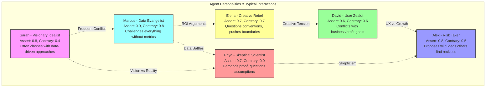
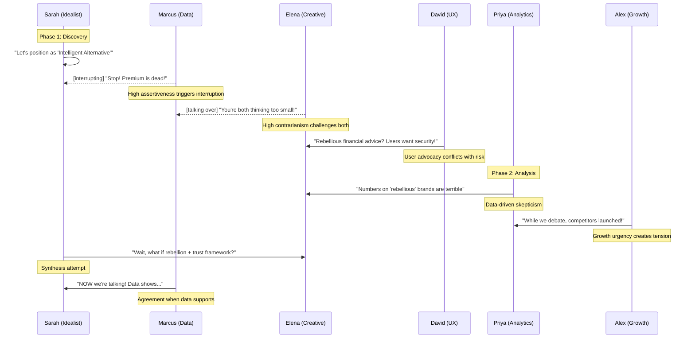
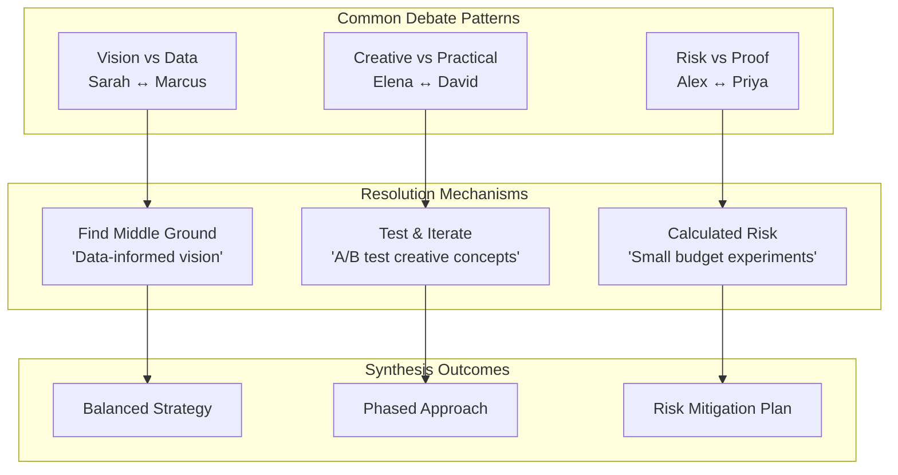
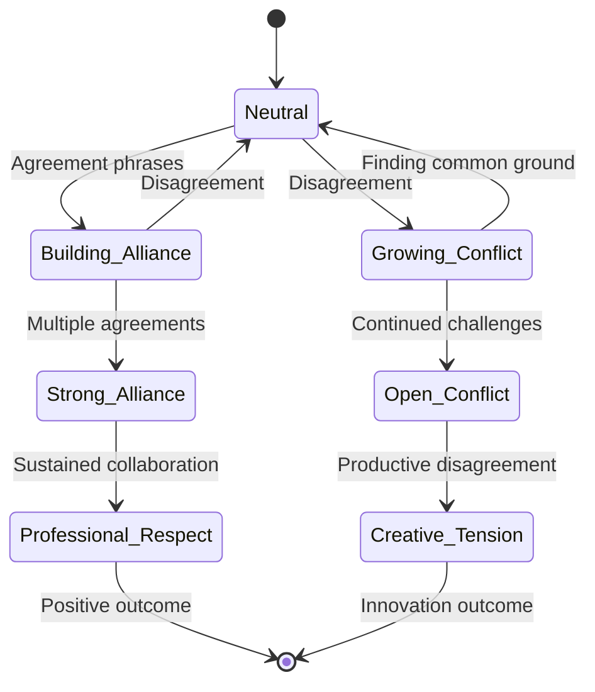
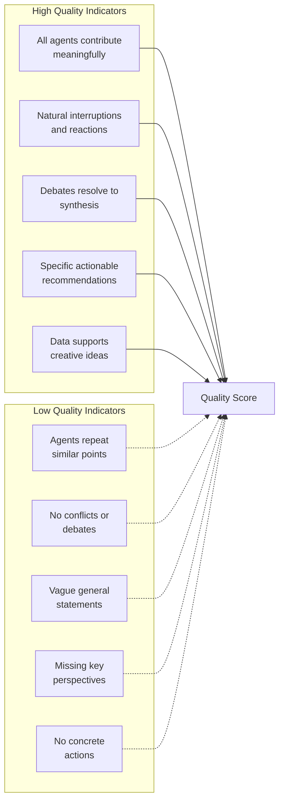

# Agent Interaction Dynamics

## Agent Personality Matrix



## Typical Conversation Pattern



## Debate Resolution Patterns



## Dynamic Relationship Evolution



## Conversation Quality Indicators



## Example Interaction Patterns

### Pattern 1: The Data Challenge
```
Sarah: "We should position as premium..."
Marcus: [interrupting] "Premium positioning shows 23% lower conversion!"
Sarah: "But brand equity studies indicate..."
Marcus: "Show me the ROI numbers!"
Priya: "Actually, segmented data reveals premium works for high-value cohorts"
Resolution: Tiered positioning strategy
```

### Pattern 2: The Creative Clash
```
Elena: "What if we made investing feel rebellious?"
David: "Users lose money with 'rebellious' UX patterns"
Elena: "Not rebellion in execution, rebellion in messaging"
Alex: "Robinhood proved controversial can drive growth"
Priya: "Until regulatory issues cost them $65M"
Resolution: Bold messaging with conservative UX
```

### Pattern 3: The Speed Debate
```
Alex: "Launch fast, iterate later!"
Priya: "Rushing leads to 3x higher CAC"
Alex: "But first-mover advantage..."
Marcus: "Data shows fast followers often win"
Sarah: "What if we're fast but strategic?"
Resolution: Phased rapid deployment

```

## Improvement Opportunities Based on Dynamics

1. **Enhanced Conflict Resolution**
   - Add mediator agent for deadlocks
   - Implement voting mechanisms
   - Create compromise generation

2. **Deeper Personality Evolution**
   - Agents learn from successful debates
   - Personality traits adjust over time
   - Team dynamics evolve with experience

3. **Multi-Party Interactions**
   - Support 3+ agent simultaneous debates
   - Coalition formation mechanics
   - Subgroup breakout discussions

4. **Emotional Intelligence**
   - Detect conversation temperature
   - Cool down heated debates
   - Celebrate breakthrough moments

5. **Cultural Dynamics**
   - Different debate styles
   - Regional market perspectives
   - Industry-specific personalities