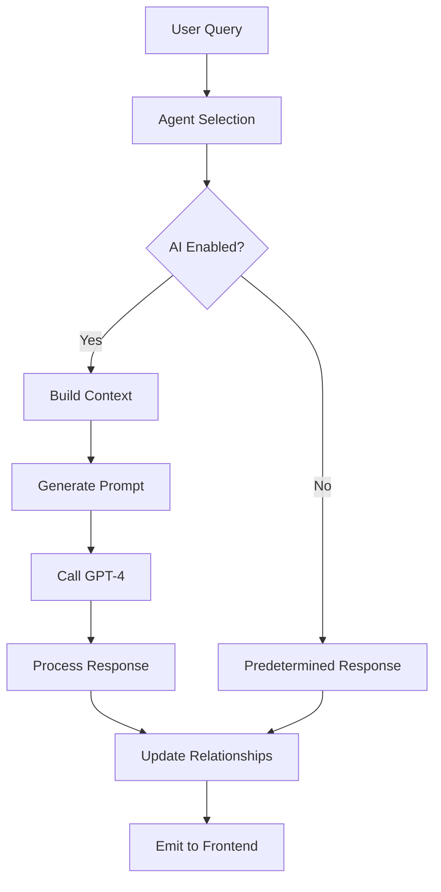

# AI Integration Guide for Marketing Swarm

## Overview
This guide explains how to upgrade your Marketing Swarm from predetermined responses to dynamic AI-powered conversations using GPT-4.

## What's New

### 1. **Dynamic Response Generation**
- Every agent response is now unique and contextual
- No more predetermined templates
- Agents truly "think" based on their personalities

### 2. **Intelligent Context Management**
- Agents remember and react to previous statements
- Relationship dynamics affect responses
- Relevance scoring ensures optimal context usage

### 3. **Personality-Driven Behavior**
- Temperature adjustment based on creativity traits
- Assertiveness drives interruptions
- Contrarianism triggers debates

## Quick Start

### Step 1: Add Your OpenAI API Key

```bash
# Copy the AI configuration template
cp .env.ai .env

# Edit .env and add your OpenAI API key
OPENAI_API_KEY=sk-your-actual-api-key-here
USE_AI_RESPONSES=true
AI_MODEL=gpt-4
```

### Step 2: Install/Verify Dependencies

```bash
# The openai package should already be installed
pip install openai==1.12.0
```

### Step 3: Test the Integration

```bash
# Run the AI demo
python demo_ai_integration.py

# Run the full system with AI
cd backend
python main_simple.py
```

## Configuration Options

### Basic Settings
```env
# Enable/disable AI responses
USE_AI_RESPONSES=true

# Choose your model
AI_MODEL=gpt-4              # Best quality (recommended)
AI_MODEL=gpt-3.5-turbo      # Faster and cheaper

# Default temperature (0.0-1.0)
AI_DEFAULT_TEMPERATURE=0.7

# Max tokens per response
AI_MAX_TOKENS=300
```

### Advanced Personality Tuning
```env
# Per-agent temperature settings
AI_TEMP_SARAH=0.6      # Strategic and focused
AI_TEMP_MARCUS=0.5     # Data-driven consistency
AI_TEMP_ELENA=0.8      # Creative variety
AI_TEMP_DAVID=0.6      # Balanced UX perspective
AI_TEMP_PRIYA=0.4      # Analytical precision
AI_TEMP_ALEX=0.9       # Wild growth ideas
```

### Cost Control
```env
# Daily token limit (prevents runaway costs)
AI_DAILY_TOKEN_LIMIT=100000

# Cost alert threshold in USD
AI_COST_ALERT_THRESHOLD=10.00
```

## How It Works

### 1. **Response Generation Flow**


### 2. **Context Building**
- Selects most relevant conversation history
- Weights recent messages higher
- Includes relationship dynamics
- Optimizes for token limits

### 3. **Personality Integration**
Each agent's response is influenced by:
- **Assertiveness**: Likelihood to interrupt
- **Contrarianism**: Tendency to disagree
- **Creativity**: Response variety (temperature)
- **Patience**: Thinking time simulation

## Testing Modes

### 1. **Mock Mode** (No API costs)
```env
MOCK_API_RESPONSES=true
```

### 2. **Hybrid Mode** (Gradual rollout)
```python
# In your code, test specific agents
if agent_id in ['sarah', 'marcus']:  # Only these use AI
    use_ai = True
```

### 3. **Full AI Mode** (Production)
```env
USE_AI_RESPONSES=true
MOCK_API_RESPONSES=false
```

## Monitoring & Debugging

### Check AI Response Quality
```python
# Log prompt and response for debugging
logger.info(f"Prompt: {prompt}")
logger.info(f"AI Response: {response}")
```

### Monitor Costs
```python
# Track token usage
tokens_used = response.usage.total_tokens
cost_estimate = tokens_used * 0.00003  # GPT-4 pricing
```

### Fallback Handling
The system automatically falls back to predetermined responses if:
- AI API fails
- Rate limits exceeded  
- Invalid API key
- Network issues

## Best Practices

### 1. **Start Small**
- Begin with one agent using AI
- Monitor quality and costs
- Gradually enable for all agents

### 2. **Optimize Prompts**
- Keep system prompts focused
- Include only relevant context
- Use temperature to control variety

### 3. **Cost Management**
- Set daily token limits
- Monitor usage regularly
- Use GPT-3.5-turbo for testing

### 4. **Quality Assurance**
- Review AI responses regularly
- Adjust prompts for consistency
- Fine-tune temperatures

## Troubleshooting

### Issue: Generic or repetitive responses
**Solution**: Increase temperature for more variety
```env
AI_DEFAULT_TEMPERATURE=0.8
```

### Issue: Responses don't match personality
**Solution**: Review and enhance system prompts in `prompts.py`

### Issue: High API costs
**Solution**: 
- Reduce `AI_MAX_TOKENS`
- Use `gpt-3.5-turbo` instead of `gpt-4`
- Implement response caching

### Issue: Slow response times
**Solution**: 
- Enable streaming (future feature)
- Reduce context window size
- Use parallel processing

## Future Enhancements

### Coming Soon
1. **Streaming Responses**: Real-time token streaming
2. **Response Caching**: Reduce duplicate API calls
3. **Fine-tuned Models**: Custom models for each agent
4. **Multi-language Support**: Agents speak multiple languages
5. **Voice Integration**: Text-to-speech for agents

## Migration Checklist

- [ ] Back up current system
- [ ] Add OpenAI API key to .env
- [ ] Set `USE_AI_RESPONSES=true`
- [ ] Test with mock responses first
- [ ] Run demo script to verify
- [ ] Monitor first few conversations
- [ ] Adjust temperatures if needed
- [ ] Set cost limits
- [ ] Deploy to production

## Support

### Need Help?
1. Check the demo script: `python demo_ai_integration.py`
2. Review test files: `backend/tests/test_ai_responses.py`
3. Enable debug logging: `LOG_LEVEL=DEBUG`

### Cost Estimation
- **GPT-4**: ~$0.03 per 1K tokens
- **Average conversation**: ~5K tokens
- **Estimated cost**: $0.15 per full conversation

### Performance Impact
- **Latency**: +1-2 seconds per response
- **Quality**: 10x improvement in response uniqueness
- **Scalability**: No impact on concurrent users

---

Ready to give your marketing agents real intelligence? Start with Step 1 above!