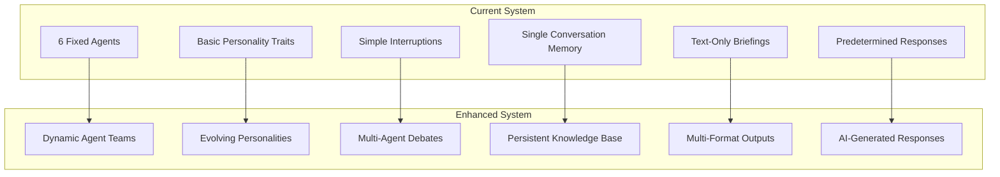
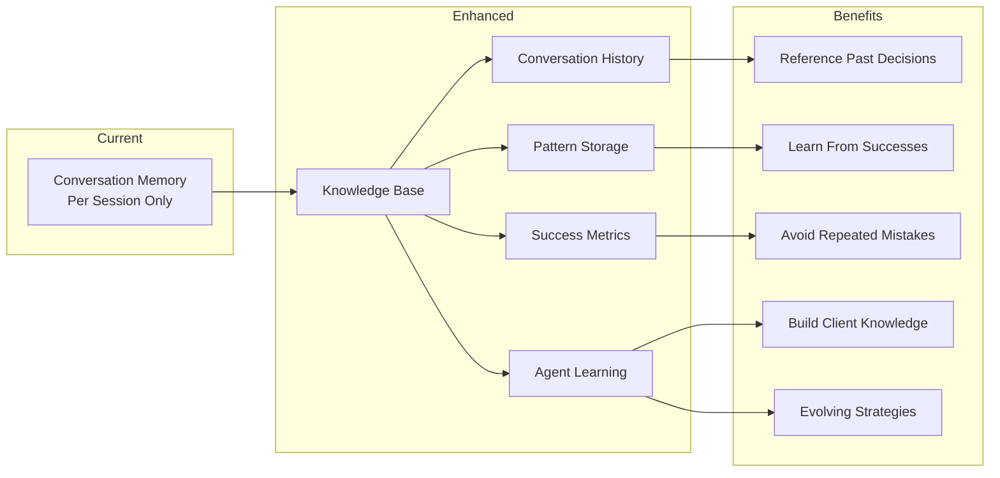
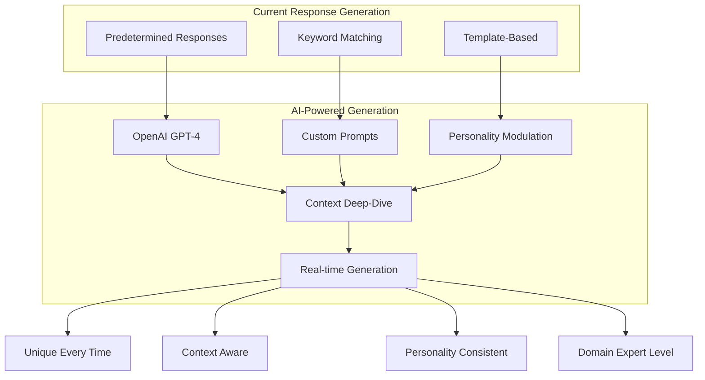
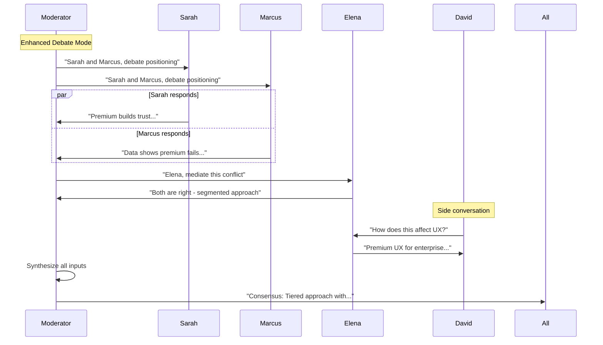
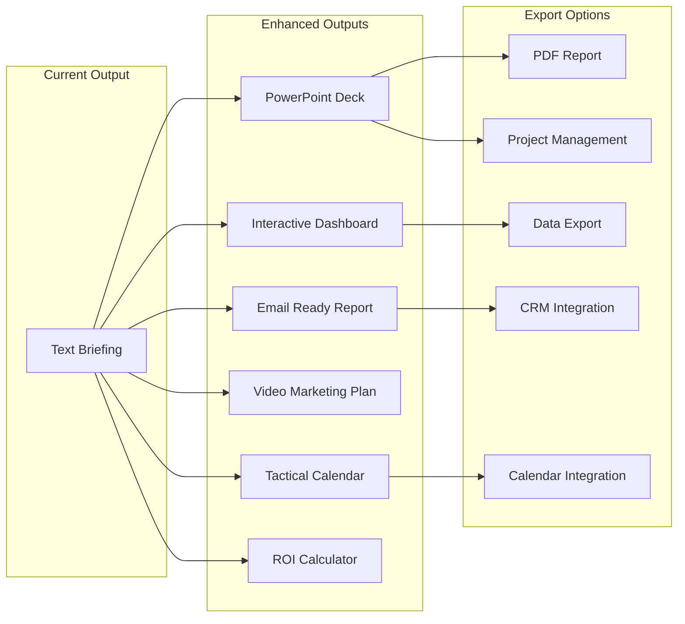
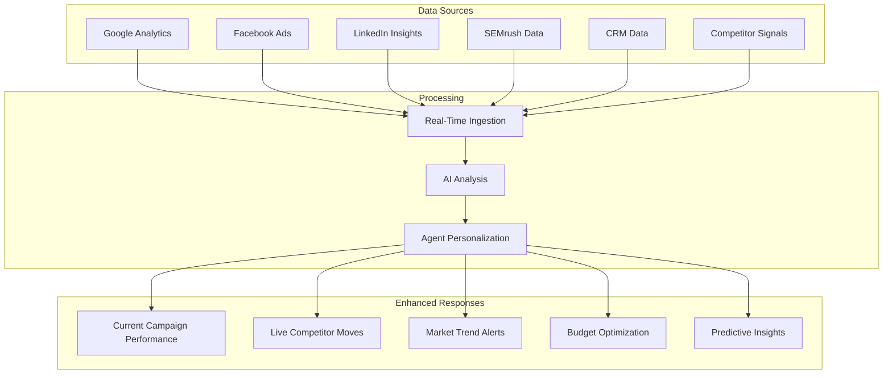
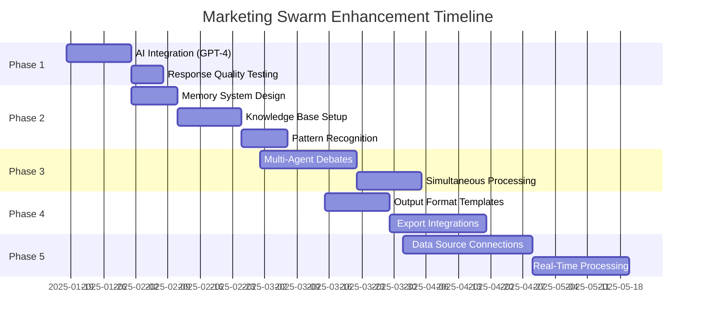

# Marketing Swarm Improvement Roadmap

## Current State vs Enhanced Future State



## Priority 1: Enhanced Memory & Learning System



## Priority 2: Real AI Integration



## Priority 3: Multi-Agent Simultaneous Interactions



## Priority 4: Advanced Output Formats



## Priority 5: Real-Time Data Integration



## Implementation Phases



## Quick Wins (Implement This Week)

### 1. Add GPT-4 Integration
```python
# Replace predetermined responses with:
async def generate_ai_response(agent_id, query, context):
    prompt = f"""
    You are {agent_data['name']}, a {agent_data['role']}.
    Personality: {agent_data['personality']}
    Expertise: {agent_data['expertise']}
    
    Current conversation context: {context}
    User query: {query}
    
    Respond in character with your personality traits:
    - Assertiveness: {agent_data['assertiveness']}
    - Contrarianism: {agent_data['contrarianism']}
    
    Make your response specific, actionable, and true to your role.
    """
    
    return await openai_client.chat.completions.create(
        model="gpt-4",
        messages=[{"role": "system", "content": prompt}]
    )
```

### 2. Add Basic Memory
```python
# Simple SQLite memory system
class ConversationMemory:
    def store_conversation(self, conv_id, query, responses, outcomes):
        # Store in database
        pass
    
    def retrieve_similar(self, query):
        # Find similar past conversations
        pass
    
    def get_client_history(self, client_id):
        # Get all interactions with client
        pass
```

### 3. Enhance Briefing Output
```python
# Add multiple format generation
def generate_outputs(briefing_data):
    outputs = {
        'markdown': generate_markdown_brief(briefing_data),
        'html': generate_html_report(briefing_data),
        'json': briefing_data,
        'executive_email': generate_email_summary(briefing_data),
        'action_items_csv': extract_action_items_csv(briefing_data)
    }
    return outputs
```

## Competitive Advantages After Enhancement

1. **Only AI marketing consultation with personality-driven dynamics**
2. **Learns and improves from every client interaction**
3. **Generates truly unique strategies, not templates**
4. **Real-time market data integration**
5. **Multiple output formats for different stakeholders**
6. **Persistent organizational knowledge building**

## ROI Projection

- **Current**: Impressive demo, limited production use
- **After Phase 1**: Production-ready for small teams
- **After Phase 3**: Enterprise-ready solution
- **After Phase 5**: Industry-leading AI marketing platform

## Next Steps

1. **Immediate**: Integrate OpenAI API for dynamic responses
2. **Week 1**: Implement basic conversation memory
3. **Week 2**: Enhance output formats
4. **Month 1**: Deploy multi-agent debates
5. **Month 2**: Connect real-time data sources