# Marketing Swarm System Flow Diagram

## Overview
This document provides a visual representation of how the Marketing Swarm dynamic agent collaboration system works.

## System Architecture Flow


## Agent Personality System


## Dynamic Conversation Flow


## Agent Selection Algorithm

```mermaid
flowchart LR
    subgraph "Selection Factors"
        CF[Current Agent<br/>Personality]
        LM[Last Message<br/>Content]
        AS[Agents Who<br/>Haven't Spoken]
        RH[Relationship<br/>History]
    end
    
    subgraph "Selection Rules"
        R1[High Assertiveness<br/>→ Triggers Contrarians]
        R2[Domain Keywords<br/>→ Domain Experts]
        R3[Unspoken Agents<br/>→ Higher Priority]
        R4[Conflict History<br/>→ More Likely to Respond]
    end
    
    CF --> R1
    LM --> R2
    AS --> R3
    RH --> R4
    
    R1 --> NA[Next Agent]
    R2 --> NA
    R3 --> NA
    R4 --> NA
```



## Relationship Tracking System

```mermaid
graph TD
    subgraph "Relationship Types"
        AL[Alliances<br/>Agreement Counter]
        CF[Conflicts<br/>Disagreement Counter]
        RL[Respect Levels<br/>-10 to +10]
    end
    
    subgraph "Triggers"
        AG[Agreement Phrases<br/>"building on"<br/>"exactly"<br/>"brilliant"]
        DG[Disagreement Phrases<br/>"disagree"<br/>"wrong"<br/>"stop"]
        RF[Reference Phrases<br/>Mentioning other<br/>agents by name]
    end
    
    AG --> AL
    DG --> CF
    RF --> RL
    
    AL --> RS[Relationship<br/>Summary]
    CF --> RS
    RL --> RS
```

## Professional Output Generation


## Real-Time Communication Flow


## Key Features Illustrated

### 1. **Dynamic Personality System**
- Each agent has quantified traits that affect behavior
- Assertiveness affects interruption likelihood
- Contrarianism drives debates and conflicts
- Creativity and patience influence response timing

### 2. **Natural Conversation Flow**
- No rigid turn-taking
- Agents interrupt based on personality
- Reactions to previous statements
- Dynamic timing creates realistic pace

### 3. **Intelligent Agent Selection**
- Domain expertise triggers (e.g., "data" → Priya)
- Personality-based reactions (assertive → contrarian response)
- Ensures all agents participate meaningfully
- Weighted by relationship history

### 4. **Professional Output**
- Conversations build toward actionable briefing
- Multiple phases ensure comprehensive analysis
- Synthesis creates executive-ready documents
- Specific metrics and implementation plans

## Improvement Opportunities

Based on this flow analysis, here are potential improvements:

1. **Enhanced Memory System**
   - Persistent conversation history across sessions
   - Learning from successful strategies
   - Building organizational knowledge base

2. **More Sophisticated Interruptions**
   - Multi-agent simultaneous responses
   - Emotional escalation mechanics
   - Coalition formation during debates

3. **Advanced Output Generation**
   - Multiple output formats (slides, reports, emails)
   - Confidence scoring for recommendations
   - Alternative scenario planning

4. **Real-Time Adaptation**
   - Adjust personalities based on conversation success
   - Dynamic phase transitions based on quality metrics
   - User feedback integration

5. **External Integration**
   - Real market data integration
   - Competitor analysis APIs
   - Industry benchmark databases